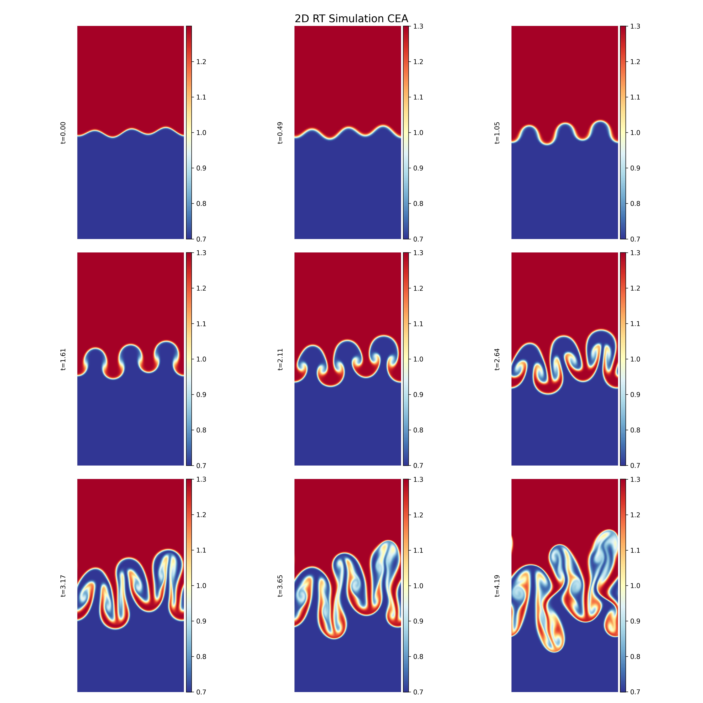
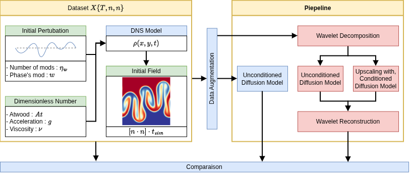
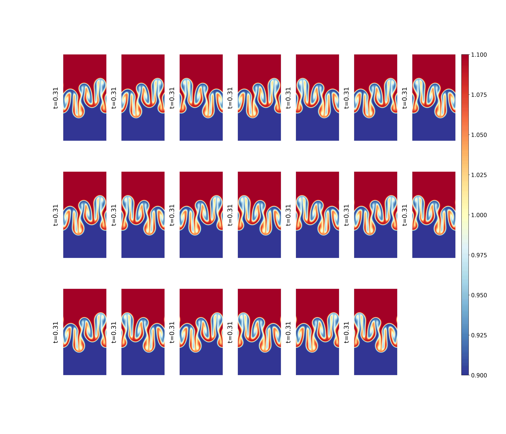
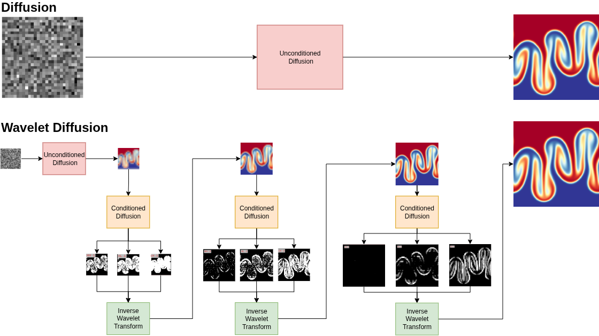
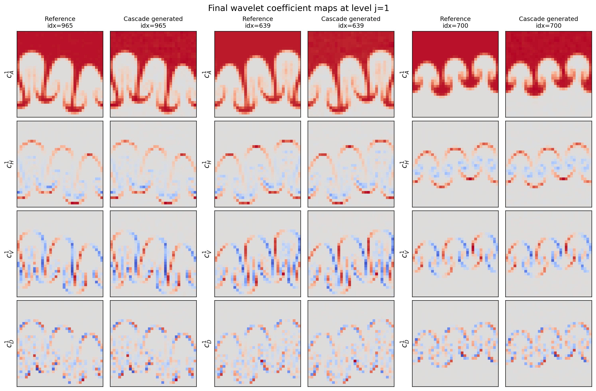
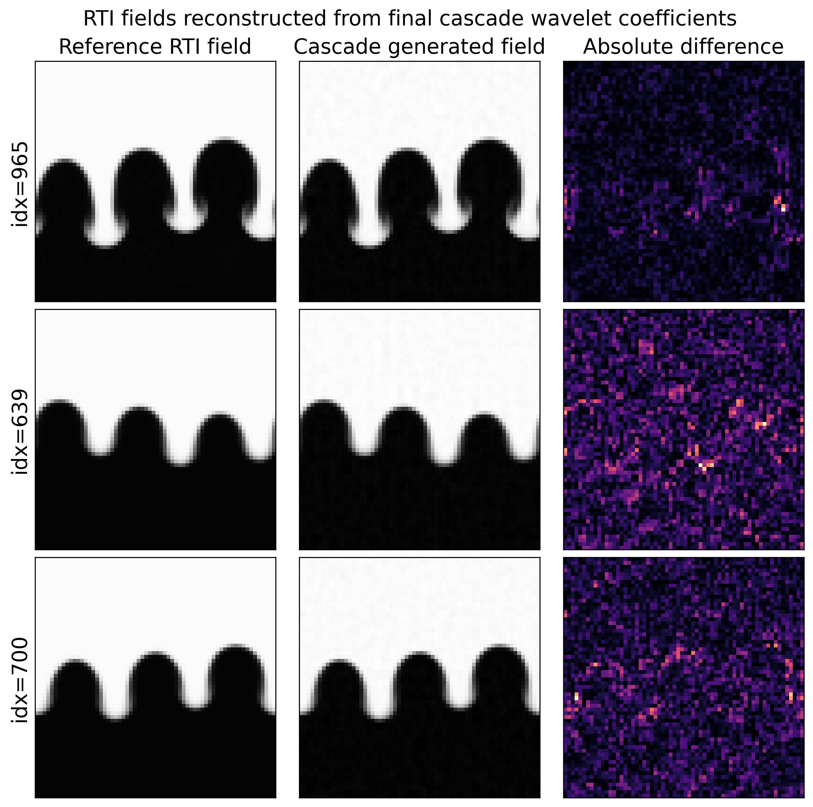

# Wavelet-Based Diffusion Surrogate Models for Rayleigh-Taylor Instability

This repository contains experimental code developed during an internship at CEA on generative surrogate modeling for two-dimensional Rayleigh-Taylor instability (RTI) density fields. The current pipeline is centered on score-based generative models (SGM), both directly in physical image space and in a wavelet multi-resolution representation.

The full scientific and methodological description is available in the internship report: [`doc/BDRPReportTemplate/Thesis.pdf`](doc/BDRPReportTemplate/Thesis.pdf).



## Scientific Context

Direct Numerical Simulations (DNS) provide high-fidelity descriptions of Rayleigh-Taylor instability, but they are computationally expensive. This limits the number of available realizations and motivates the use of generative surrogate models able to produce new fields with similar statistical and physical properties.

RTI is strongly nonlinear and multi-scale: large coherent structures coexist with fine interfacial fluctuations inside the mixing zone. This makes the problem interesting for score-based diffusion models, and especially for wavelet-based approaches that explicitly separate coarse structures from localized details.



## Implemented Approaches

The active pipeline is organized around two SGM experiments:

- **Image-space SGM**: a continuous-time score-based generative model trained directly on preprocessed RTI density fields.
- **Wavelet SGM cascade**: a full score-based cascade in wavelet space. An unconditional SGM generates the coarse approximation `cA`, then conditional SGM models generate the detail channels `cH`, `cV`, and `cD` level by level.

Older DDPM scripts are still present in the repository as previous exploratory work, but they are not the main pipeline described here.

The overall workflow is:

1. load 2D DNS density fields;
2. crop the fields while preserving the physically relevant mixing zone;
3. apply physically consistent data augmentation;
4. train an SGM model;
5. generate new samples;
6. evaluate the generated fields with visual, statistical, feature-space, and physics-oriented metrics.

Only augmentations compatible with the governing physics are used: horizontal periodic shifts and horizontal reflections. Vertical shifts, vertical flips, and arbitrary rotations are avoided because they would alter the physical meaning of the gravity-driven configuration.



## Wavelet-Based Modeling

The wavelet formulation decomposes each RTI field into one approximation channel and three detail channels at each scale. The motivation is to provide the generative model with a scale-aware representation:

- `cA`: low-frequency approximation;
- `cH`: horizontal details;
- `cV`: vertical details;
- `cD`: diagonal details.

The cascade model learns coarse-to-fine dependencies by generating wavelet details conditioned on coarser information, then reconstructing the final density field through inverse wavelet transforms.



## Main Results From The Report

The direct image-space SGM learns non-trivial statistical information about the RTI dataset. On 1000 images, the report gives the following comparison for the generated RTI samples:

| Comparison | PhyFID | Inception FID |
| --- | ---: | ---: |
| validation vs validation | 0.021 | 0.0013 |
| validation vs train | 0.023 | 0.0008 |
| validation vs generated SGM | 0.132 | 0.134 |
| validation vs noise | 6.04 | 42.05 |
| validation vs MNIST | 4.26 | 14.27 |

The generated SGM samples are much closer to the validation dataset than pure noise or unrelated MNIST images. Physics-oriented indicators based on vertical density profiles and fluctuation spectra show the same trend.

The wavelet SGM cascade captures meaningful relationships between coarse approximations and detail coefficients, but the current reconstructions remain visibly rougher than the direct image-space SGM samples. In its current state, the wavelet approach is promising for interpretability and scale-aware generation, but it still needs architectural and conditioning improvements.





## Repository Structure

```text
.
|-- SGM_Foward.py                          # image-space SGM training
|-- SGM_Generator.py                       # image-space SGM generation
|-- WSGM_Foward_and_Generator.py           # full wavelet SGM cascade pipeline
|-- WSGM_Config.json                       # main wavelet SGM cascade configuration
|-- WSGM_README                            # detailed WSGM usage notes
|-- ERROR_Computation.py                   # FID, PhyFID, and physical metrics
|-- DDPM_Foward.py                         # legacy image-space DDPM experiment
|-- DDPM_Generator.py                      # legacy DDPM generation script
|-- Wave_Cascade_DDPM_Foward_and_Generator.py # legacy wavelet DDPM experiment
|-- Wave_Cascade_Config_DDPM.json          # legacy wavelet DDPM configuration
|-- lib/
|   |-- cea_lib/                           # CEA data loading, augmentation, and analysis
|   |-- diffusion_lib/                     # SGM core models, U-Net, logs, training loops
|   |-- wavelet_diffusion_lib/             # wavelet tools and conditional SGM utilities
|   |-- PhyFID/                            # PhyFID metric for physical fields
|   `-- pytorch-fid-master/                # local FID implementation
|-- analyse_outils/                        # exploratory analysis notebooks
|-- analyse_reslutat/                      # result visualization notebooks
|-- exemples/                              # educational notebooks
|-- data/                                  # local data, not necessarily versioned
`-- doc/BDRPReportTemplate/                # internship report
```

## Expected Data Format

The complete CEA DNS dataset is not publicly distributed in this repository. The scripts expect preprocessed PyTorch tensors under `data/RT64`.

For image-space models:

```text
data/RT64/processed/
  training.pt
  validation.pt
  test.pt
```

For wavelet models, each level `j` is stored as a tensor of shape `[N, 4, H, W]`:

```text
data/RT64/processed/
  j1_training.pt
  j1_validation.pt
  j1_test.pt
  j2_training.pt
  j2_validation.pt
  j2_test.pt
  j3_training.pt
  j3_validation.pt
  j3_test.pt
```

Wavelet tensor channels:

| Channel | Coefficient |
| ---: | --- |
| 0 | `cA`, low-frequency approximation |
| 1 | `cH`, horizontal details |
| 2 | `cV`, vertical details |
| 3 | `cD`, diagonal details |

## Installation

The project does not currently include a `requirements.txt`. The main dependencies inferred from the code are:

```bash
pip install torch torchvision numpy scipy matplotlib pandas h5py pillow tqdm PyWavelets torchview
```

To use the local FID implementation:

```bash
pip install -e lib/pytorch-fid-master
```

For GPU runs, install the PyTorch build matching the available CUDA version.

## Quick Usage

Run scripts from the repository root.

Train the direct image-space SGM:

```bash
python SGM_Foward.py
```

Generate samples from an image-space SGM checkpoint:

```bash
python SGM_Generator.py
```

Train or run the full wavelet SGM cascade:

```bash
python WSGM_Foward_and_Generator.py
```

The main configuration file is [`WSGM_Config.json`](WSGM_Config.json). Important fields include:

- `levels`: wavelet levels used in the cascade, for example `[1, 2, 3]`;
- `coarse`: unconditional SGM used to generate the coarse `cA` coefficient;
- `train.enabled`: enables or disables training of conditional SGM detail models;
- `generate.enabled`: enables or disables sample generation;
- `generate.initial_ca_source`: selects the source of the initial `cA` (`dataset`, `coarse_sgm`, or `generated`).

Compute metrics:

```bash
python ERROR_Computation.py
```

## Outputs

The scripts mainly produce:

```text
outputs/
  logs/                  # text and CSV logs
  img/                   # diagnostic visualizations
  generated/             # generated tensors
  saved_models/          # checkpoints and saved configurations
```

Exact paths depend on the selected configuration.

## Reproducibility Notes

This repository reflects an exploratory internship project. Some components are organized as reusable local libraries (`lib/diffusion_lib`, `lib/wavelet_diffusion_lib`), while other folders contain notebooks and research prototypes.

The report results cannot be reproduced directly without access to the original CEA DNS data and associated checkpoints. To reproduce the methodology on another RTI dataset, prepare tensors matching the formats described above, then run the training, generation, and evaluation scripts.

## Report

The internship report provides the full scientific and experimental background:

- physical context of Rayleigh-Taylor instability;
- Fourier and wavelet representations for multi-scale fields;
- diffusion and score-based generative models;
- direct image-space SGM baseline;
- conditional SGM on wavelet coefficients;
- evaluation with FID, PhyFID, vertical mean profiles, and fluctuation spectra;
- limitations and research perspectives.

Main report file: [`doc/BDRPReportTemplate/Thesis.pdf`](doc/BDRPReportTemplate/Thesis.pdf).

## Status

Research prototype. The current code path is centered on full SGM generation: an image-space SGM baseline and a wavelet SGM cascade. The wavelet-based direction remains promising for multi-scale interpretability and physics-aware generation, but still requires improvements in conditioning, architecture design, and full quantitative evaluation.
