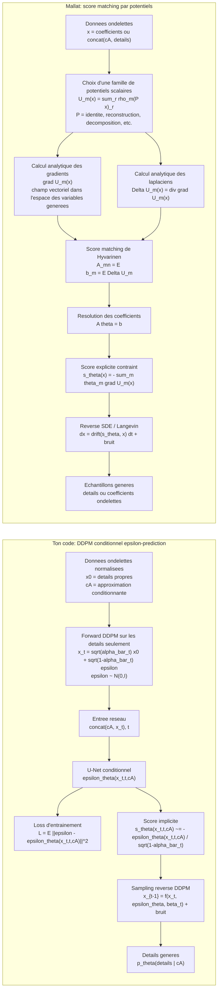
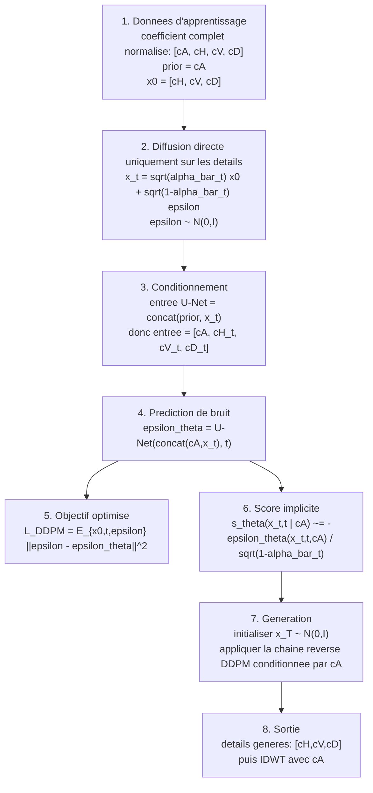
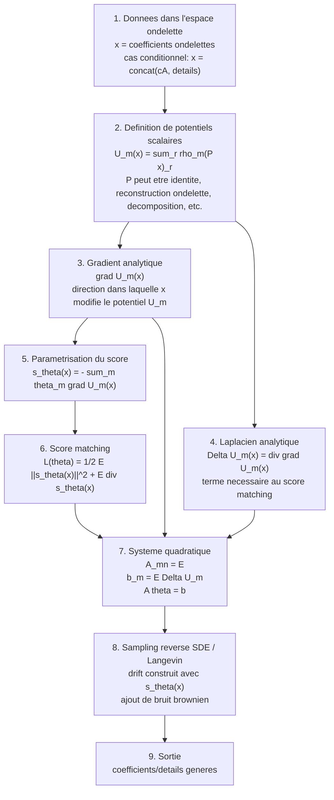

# Schema: score DDPM conditionnel vs score par potentiels de Mallat

Ce fichier compare deux manieres de construire le score utilise pour generer les details d'ondelettes.

- Methode du code actuel : le score est appris implicitement via une prediction de bruit `epsilon_theta`.
- Methode Mallat : le score est construit explicitement comme combinaison de gradients de potentiels `U_m`.

## Vue Globale



## Methode 1: ton DDPM conditionnel



Description des etapes :

1. `cA` est conserve comme variable conditionnante. Les details `x0 = [cH,cV,cD]` sont les variables aleatoires a generer.
2. Le processus forward ajoute du bruit gaussien aux details, pas au prior.
3. Le reseau recoit `cA` et les details bruites par concatenation de canaux.
4. Le U-Net ne predit pas directement le score. Il predit le bruit `epsilon`.
5. La loss est une MSE de bruit. Elle favorise une bonne prediction moyenne de `epsilon`.
6. Le score est reconstruit implicitement par la relation DDPM `score ~= -epsilon_theta / sigma_t`.
7. Le sampling utilise ce score implicite dans la formule reverse.
8. Les details generes sont recombines avec `cA` par transformee ondelette inverse.

Point structurel :

```math
s_\theta(x_t,t \mid cA)
\approx
\nabla_{x_t} \log p_t(x_t \mid cA)
\approx
-\frac{\epsilon_\theta(x_t,t,cA)}{\sqrt{1-\bar\alpha_t}}
```

Le score est donc un champ vectoriel neuronal libre. Sa regularite depend du U-Net, de la normalisation, du conditionnement et des donnees.

## Methode 2: Mallat par potentiels



Description des etapes :

1. Les donnees sont vues comme des champs de coefficients ondelettes.
2. Les `U_m` sont des fonctions scalaires qui mesurent des statistiques locales ou inter-echelles du champ.
3. `grad U_m(x)` est un champ vectoriel. C'est une brique elementaire du score.
4. `Delta U_m(x)` est calcule analytiquement. Il sert a evaluer la divergence du score dans la loss de Hyvarinen.
5. Le score n'est pas un reseau libre. Il est contraint a etre une combinaison lineaire de gradients de potentiels.
6. Le score matching evite d'avoir besoin du vrai score des donnees.
7. Comme la parametrisation est lineaire en `theta`, l'optimisation se reduit a un probleme quadratique.
8. Le score explicite est injecte dans une dynamique reverse SDE ou dans des corrections de Langevin.
9. Les echantillons suivent les contraintes statistiques imposees par les potentiels choisis.

Point structurel :

```math
E_\theta(x) = \sum_m \theta_m U_m(x)
```

```math
s_\theta(x)
= \nabla_x \log p_\theta(x)
\approx -\nabla_x E_\theta(x)
= -\sum_m \theta_m \nabla_x U_m(x)
```

Score matching de Hyvarinen :

```math
\mathcal L(\theta)
=
\frac{1}{2}\mathbb E_{p_{data}} \|s_\theta(x)\|^2
+
\mathbb E_{p_{data}}[\nabla \cdot s_\theta(x)]
```

Avec `s_theta(x) = -sum_m theta_m grad U_m(x)`, on obtient :

```math
A_{mn}
=
\mathbb E
\left[
\langle \nabla U_m(x), \nabla U_n(x) \rangle
\right]
```

```math
b_m
=
\mathbb E
\left[
\Delta U_m(x)
\right]
```

```math
A\theta = b
```

## Exemple concret de potentiel

Potentiel local quartique simple :

```math
U(x) = \sum_r x_r^4
```

Gradient :

```math
\nabla U(x)_r = 4 x_r^3
```

Interprétation :

- `U(x)` mesure l'energie non gaussienne des grandes amplitudes.
- `grad U(x)` produit une force tres forte sur les coefficients de grande amplitude.
- Cette force peut aider a modeliser des queues de distribution et de l'intermittence.

Potentiel applique apres reconstruction ondelette :

```math
U_m(w)
=
\sum_r \rho_m((R w)_r)
```

avec :

- `w` : coefficients ondelettes.
- `R` : reconstruction ondelette vers une echelle plus fine.
- `rho_m` : non-linearite scalaire.

Gradient :

```math
\nabla_w U_m(w)
=
R^T \rho_m'(R w)
```

Dans le code de Mallat, ce gradient est calcule par reconstruction puis redecomposition ondelette. C'est ce qui donne un score coherent avec la geometrie multi-echelle.

## Difference essentielle

| Aspect | Ton DDPM conditionnel | Mallat |
|---|---|---|
| Objet appris | Bruit `epsilon_theta` | Coefficients `theta_m` |
| Score | Implicite, derive de `epsilon_theta` | Explicite, somme de gradients |
| Forme du score | Champ neuronal libre | Champ contraint par potentiels |
| Objectif | MSE sur le bruit | Score matching de Hyvarinen |
| Geometrie ondelette | Donnee au reseau via les canaux | Encodee dans les potentiels |
| Localite/stationnarite | Depend de l'architecture | Imposee par construction |
| Risque principal | Score moyen lisse, sous-dispersion des details | Biais fort si les potentiels sont mal choisis |

## Lecture courte

Ton modele apprend :

```math
[cA, x_t, t] \mapsto \epsilon_\theta
```

puis en deduit :

```math
s_\theta \approx -\epsilon_\theta / \sigma_t
```

Mallat construit :

```math
U_1, \dots, U_M
```

puis apprend :

```math
s_\theta(x) = -\sum_m \theta_m \nabla U_m(x)
```

La difference fondamentale est donc que Mallat choisit d'abord une famille de forces admissibles `grad U_m`, puis apprend leur combinaison. Ton DDPM apprend directement une force generale via un reseau.


$$
x_t = \sqrt{\bar\alpha_t}x_0 + \sqrt{1-\bar\alpha_t}\epsilon
$$

$$
\epsilon_\theta(x_t,t,cA)
$$

$$
dX_t = -X_t dt + \sqrt{2\sigma}\,dB_t
$$